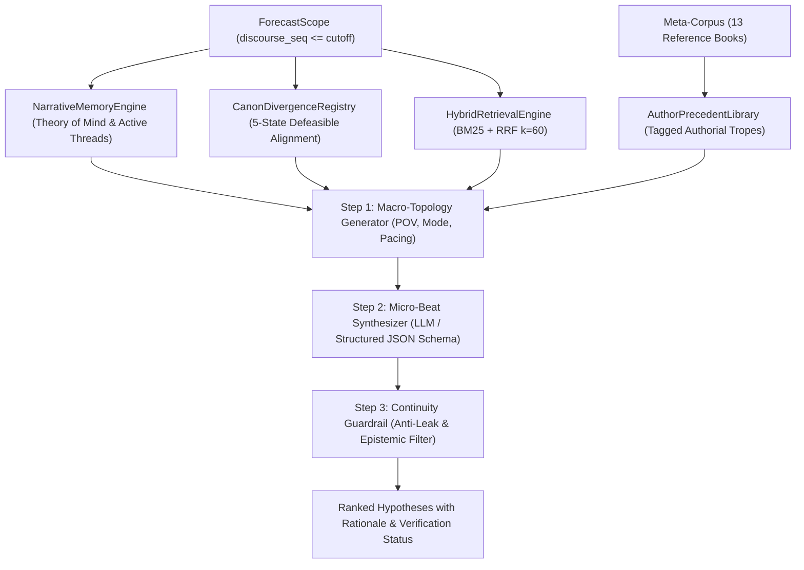

# Story Forecaster

<p align="left">
  
  
  
</p>

## Overview

Story Forecaster is an open-source neuro-symbolic narrative intelligence system engineered for prospective story forecasting, narrative structure modeling, and leak-free plot hypothesis generation for ongoing serial fiction.

Standard Large Language Models (LLMs) struggle with narrative continuation over long horizons due to three fundamental challenges:
1. Epistemic drift and omniscient bleeding: characters frequently act on knowledge they have not yet acquired in the narrative.
2. Timeline leakage: models inadvertently anticipate future plot twists beyond the current cutoff boundary.
3. Canon hallucination and rule contradictions: models violate cross-world mechanics or authorial stylistic patterns.

Story Forecaster addresses these challenges by combining deterministic symbolic constraints (immutable scope boundaries, Theory of Mind state tracking, defeasible canon ontologies) with a model-agnostic LLM generation layer and a hybrid BM25/RRF retrieval engine.

The system is evaluated against the Russian web novel *"Система Абсолютного З.Л.А."* by author N.B. (~1.12 million characters, crossover: *Highschool of the Dead* + *KonoSuba* + *Diablo* mechanics), supported by an authorial meta-corpus of 13 works (~20 million characters).

---

## System Architecture



### Core Architectural Invariants

1. Zero Future Leakage (Strict Cutoff Isolation):
   The forecast context is immutably sealed via the frozen `ForecastScope` contract. Every database query, memory snapshot, and search index query is mathematically bounded to `discourse_seq <= cutoff`. Future events, unseen characters, and late-game lore cannot bleed into prospective runs.

2. Epistemic State Modeling (Theory of Mind):
   The `NarrativeMemoryEngine` models asymmetric beliefs and knowledge states. It explicitly tracks what the protagonist knows, what subordinates know, what antagonists believe, and active false beliefs, preventing characters from acting on unrevealed facts.

3. Defeasible Canon Alignment:
   Cross-world crossovers diverge from source canon. The `CanonDivergenceRegistry` models rules across 5 epistemic states (`MODIFIED`, `CONFIRMED`, `PRESUMED_INTACT`, etc.), enforcing timeline offsets (such as protagonist enrollment occurring one year prior to the canonical outbreak).

4. Hybrid Retrieval Engine:
   Historical context is queried without temporal leakage using a hybrid BM25 engine ($k_1=1.2, b=0.75$) combined with lexical overlap and Reciprocal Rank Fusion ($RRF\ k=60$).

5. Symbolic Continuity Guardrails:
   Before accepting any prospective hypothesis, candidates undergo deterministic validation (`_verify_candidate_continuity`). Candidates that introduce undeclared characters or violate epistemic constraints are automatically flagged and demoted.

6. Bipartite Matching Backtest and Ablation:
   The evaluation module employs a greedy 1-to-1 bipartite matching algorithm against gold-standard ground truth chapters, measuring Precision, Recall, and F1 scores without inflating metrics with vague predictions.

---

## Model-Agnostic LLM Architecture

Story Forecaster is completely model-agnostic. The core pipeline is decoupled from any single AI vendor or model family through the abstract `BaseLLMProvider` interface.

Developers can plug in any LLM backend supporting structured JSON schema outputs:

* Commercial Cloud Providers:
  - Google Gemini (Gemini 3.8 Flash reference adapter included, Gemini 2.0 / 1.5)
  - OpenAI (GPT-4o, GPT-4.5, o1, o3-mini)
  - Anthropic (Claude 3.5 Sonnet, Claude 3.7 Sonnet)
  - DeepSeek (DeepSeek V3, DeepSeek R1)
* Local and Self-Hosted Open Models:
  - Local inference via Ollama, vLLM, LM Studio, or llama.cpp
* Offline Demo Provider:
  - A deterministic local provider (`demo`) is included out of the box. It runs the complete pipeline, CLI, and Web UI on synthetic fixtures with zero API keys and zero cost.

---

## Quickstart

### Prerequisites
* Python 3.11 or higher (tested on Python 3.11, 3.12, 3.13)
* SQLite 3
* Operating System: Linux, macOS, or Windows

### 1. Clone and Install
```bash
git clone https://github.com/kok-o/story-forecaster.git
cd story-forecaster

# Create and activate a virtual environment
python -m venv .venv

# On Linux / macOS:
source .venv/bin/activate
# On Windows PowerShell:
.venv\Scripts\Activate.ps1

# Install dependencies and editable package
pip install -e .

# Optional: install development dependencies for tests
pip install -e ".[dev]"
```

### 2. Configure Environment (Optional for Live LLM)
Copy the example environment configuration:
```bash
cp .env.example .env
```

If using Gemini, set your API key (available from Google AI Studio):
```ini
GEMINI_API_KEY=your_api_key_here
GEMINI_MODEL=gemini-3.8-flash
PORT=8000
```
Note: If no API key is configured, Story Forecaster operates deterministically in offline `--provider demo` mode.

### 3. Run Test Suite
```bash
pytest
```
All 47 unit and integration tests execute against an isolated SQLite test fixture.

### 4. Launch Web UI and REST API
```bash
story-forecaster serve --port 8000
# or
python -m story_forecaster.cli serve --port 8000
```

Once running, access:
* Web Dashboard: http://127.0.0.1:8000
* Interactive Swagger Docs: http://127.0.0.1:8000/docs

---

## Command-Line Interface (CLI)

Story Forecaster provides an administrative CLI built with Typer and Rich:

```bash
# Run environment diagnostics and health checks
python -m story_forecaster.cli doctor

# Inspect active novel versions, chapters, and sequence boundaries
python -m story_forecaster.cli inspect

# Generate prospective continuation hypotheses for an upcoming chapter
python -m story_forecaster.cli forecast --cutoff-chapter 23

# Run a blind backtest against gold-standard actual chapter data
python -m story_forecaster.cli backtest --cutoff-chapter 22

# Execute an ablation benchmark measuring module contributions
python -m story_forecaster.cli ablation

# Execute a hybrid search query strictly bounded by cutoff
python -m story_forecaster.cli search "Horadric Cube" --cutoff-chapter 23
```

---

## REST API Overview

The FastAPI backend exposes the following primary endpoints:

| Method | Endpoint | Description |
| :--- | :--- | :--- |
| GET | `/api/health` | Service health status and database connectivity |
| GET | `/api/status` | Active project version, chapter count, and system state |
| GET | `/api/chapters` | List of indexed chapters up to active discourse cutoff |
| POST | `/api/forecast` | Execute prospective forecast run and return ranked candidates |
| GET | `/api/runs` | Retrieve history of executed forecast runs |
| GET | `/api/runs/{run_id}` | Inspect candidate details and verification notes for a run |
| POST | `/api/backtest` | Execute blind evaluation against target gold chapter |
| GET | `/api/ablation` | Run or retrieve architecture ablation benchmark tables |

---

## Repository Structure

```
story-forecaster/
├── backend/
│   ├── src/story_forecaster/
│   │   ├── api/          # FastAPI REST endpoints and static file serving
│   │   ├── author/       # Authorial precedent library and trope indexer
│   │   ├── canon/        # Defeasible canon ontology and cross-world registry
│   │   ├── db/           # SQLAlchemy ORM models and session management
│   │   ├── domain/       # Pydantic v2 core contracts (Scope, Candidate, Snapshot)
│   │   ├── evaluation/   # 1-to-1 bipartite matching evaluator and ablation
│   │   ├── forecast/     # Two-stage topology and plot beat forecasting engine
│   │   ├── ingestion/    # Text normalizers, parsers, and incremental updater
│   │   ├── memory/       # Narrative state reducer and Theory of Mind tracker
│   │   ├── providers/    # Model-agnostic LLM interface (Base, Gemini, Demo)
│   │   ├── retrieval/    # Hybrid BM25 and Reciprocal Rank Fusion engine
│   │   └── cli.py        # Unified command-line interface
│   └── tests/            # 43 automated unit and integration tests
├── config/               # Application configuration (settings.yaml, target_work.yaml)
├── data/                 # SQLite database and target chapter slices
├── docs/                 # Technical documentation and architecture specifications
├── frontend/             # Single-page web dashboard (HTML5 / Vanilla CSS / Modern JS)
├── .env.example          # Environment variable template
├── .gitignore            # Git exclusion rules
├── LICENSE               # MIT License
├── pyproject.toml        # Build configuration and pytest settings
└── requirements.txt      # Python dependencies
```

---

## Academic and Fair Use Notice

This software is an engineering research framework developed for computational narratology and narrative intelligence research. All references to third-party works, character names, and textual excerpts are utilized strictly for academic analysis, scientific benchmarking, and non-commercial evaluation under Fair Use principles. All rights to source fictional works belong to their respective creators.

---

## License

This project is licensed under the [MIT License](LICENSE).
