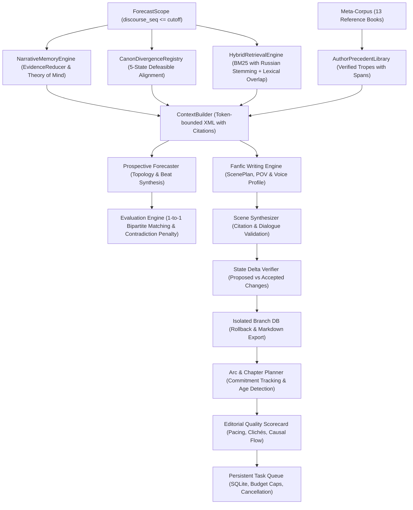

# Story Forecaster

<p align="left">
  
  
  
  
</p>

## Overview

Story Forecaster is an open-source neuro-symbolic narrative intelligence system engineered for prospective story forecasting, narrative structure modeling, leak-free plot hypothesis generation, and isolated fanfic continuation for ongoing serial fiction.

Standard Large Language Models (LLMs) struggle with narrative continuation over long horizons due to fundamental challenges:
1. Epistemic drift and omniscient bleeding: characters frequently act on knowledge they have not yet acquired in the narrative.
2. Timeline leakage: models inadvertently anticipate future plot twists beyond the current cutoff boundary.
3. Canon hallucination and rule contradictions: models violate cross-world mechanics or authorial stylistic patterns.
4. Unchecked state mutation: draft prose silently changes world facts without structured verification or ability to rollback.
5. Narrative amnesia and cliché stagnation: long-running plots forget open promises and repeat identical conflict beats.

Story Forecaster addresses these challenges by combining deterministic symbolic constraints (immutable scope boundaries, Theory of Mind state tracking, defeasible canon ontologies, verified author precedents) with a model-agnostic LLM generation layer, a Russian-aware hybrid BM25 retrieval engine, an isolated fanfic branch writing engine, and multi-chapter arc quality controls.

The system is evaluated against the Russian web novel *"Система Абсолютного З.Л.А."* by author N.B. (~1.12 million characters, crossover: *Highschool of the Dead* + *KonoSuba* + *Diablo* mechanics), supported by an authorial meta-corpus of 13 works (~20 million characters).

---

## System Architecture



### Core Architectural Invariants

1. Zero Future Leakage (Strict Cutoff Isolation):
   The forecast context is immutably sealed via the frozen `ForecastScope` contract. Every database query, memory snapshot, and search index query is mathematically bounded to `discourse_seq <= cutoff`. Future events, unseen characters, and late-game lore cannot bleed into prospective runs.

2. Epistemic State Modeling and Evidence Reduction:
   The `NarrativeMemoryEngine` and `EvidenceReducer` model asymmetric beliefs and knowledge states. World facts are strictly separated from character dialogue claims, narrator impressions, and assumptions. What the protagonist knows, what subordinates know, and active false beliefs are tracked with source coordinates.

3. Defeasible Canon Alignment and Verified Author Precedents:
   Cross-world crossovers diverge from source canon. The `CanonDivergenceRegistry` models rules across 5 epistemic states (`MODIFIED`, `CONFIRMED`, `PRESUMED_INTACT`, etc.). The `AuthorPrecedentLibrary` indexes authorial choices with exact character offsets and SHA-256 hashes, injected transparently into `ContextBuilder`.

4. Russian Morphological Hybrid Retrieval:
   Historical context is queried without temporal leakage using a BM25 engine augmented with Russian morphological stemming (Snowball/rule stemmer) and scope-bounded caching.

5. Strict 1-to-1 Bipartite Matching Evaluation:
   The evaluation module employs a strict 1-to-1 bipartite matching algorithm against gold-standard chapters. Contradictions (such as destruction vs creation) receive severe penalties (0.0 similarity), ensuring objective F1 scores across B0, B1, and B2 ablation baselines.

6. Isolated Fanfic Branches and Reversible State Deltas:
   Fanfic continuations operate in isolated `Branch` structures. Each scene requires a structured `ScenePlan` (POV, required beats, character voice profile). Proposed state changes (`ProposedStateDelta`) are validated before transactional acceptance into `AcceptedScene`. Any state mutation or character injury can be rolled back without modifying canonical source texts.

7. Multi-Chapter Arc Planning and Commitment Tracking:
   The `ArcManager` tracks long-term narrative promises (`ReaderPromise`, `ArcMilestone`). It detects aging storylines (>4 scenes without progression), unresolved mysteries, and consecutive conflict repetition.

8. Holistic Editorial Review:
   Chapters are evaluated through an `EditorialQualityScorecard` measuring scene length/pacing variance, quantitative penalties for repeated stock clichés, character voice consistency (e.g. Hachiman, Kazuma, Fairy, Saeko), and causal progression.

9. Persistent Background Task Queue:
   Long-running tasks are handled by a zero-dependency SQLite `TaskQueue` supporting step-by-step progress reporting, cooperative cancellation, and budget spend caps.

---

## Model-Agnostic LLM Architecture

Story Forecaster is completely model-agnostic. The core pipeline is decoupled from any single AI vendor or model family through the abstract `BaseLLMProvider` interface.

Developers can plug in any LLM backend supporting structured JSON schema outputs:

* Commercial Cloud Providers:
  - Google Gemini (Gemini 3.8 Flash reference adapter included, Gemini 2.0 / 1.5)
  - OpenAI (GPT-4o, GPT-4.5, o1, o3-mini)
  - Anthropic (Claude 3.5 Sonnet, Claude 3.7 Sonnet)
  - DeepSeek (DeepSeek V3, DeepSeek R1)
* Local and Self-Hosted Open Models:
  - Local inference via Ollama, vLLM, LM Studio, or llama.cpp
* Offline Demo Provider:
  - A deterministic local provider (`demo`) is included out of the box. It runs the complete pipeline, CLI, and Web UI on synthetic fixtures with zero API keys and zero cost.

---

## Quickstart

### Prerequisites
* Python 3.10 or higher (tested on Python 3.10, 3.11, 3.12, 3.13)
* SQLite 3
* Operating System: Linux, macOS, or Windows

### 1. Clone and Install
```bash
git clone https://github.com/kok-o/story-forecaster.git
cd story-forecaster

# Create and activate a virtual environment
python -m venv .venv

# On Linux / macOS:
source .venv/bin/activate
# On Windows PowerShell:
.venv\Scripts\Activate.ps1

# Install dependencies and editable package
pip install -e .

# Optional: install development dependencies for tests
pip install -e ".[dev]"
```

### 2. Configure Environment (Optional for Live LLM)
Copy the example environment configuration:
```bash
cp .env.example .env
```

If using Gemini, set your API key (available from Google AI Studio):
```ini
GEMINI_API_KEY=your_api_key_here
GEMINI_MODEL=gemini-3.8-flash
PORT=8000
```
Note: If no API key is configured, Story Forecaster operates deterministically in offline `--provider demo` mode.

### 3. Run Test Suite
```bash
pytest
```
All 90 unit and integration tests execute against isolated SQLite test fixtures.

### 4. Launch Web UI and REST API
```bash
story-forecaster serve --port 8000
# or
python -m story_forecaster.cli serve --port 8000
```

Once running, access:
* Web Dashboard: http://127.0.0.1:8000
* Interactive Swagger Docs: http://127.0.0.1:8000/docs

---

## Command-Line Interface (CLI)

Story Forecaster provides an administrative CLI built with Typer and Rich:

```bash
# Run environment diagnostics and health checks
python -m story_forecaster.cli doctor

# Inspect active novel versions, chapters, and sequence boundaries
python -m story_forecaster.cli inspect

# Generate prospective continuation hypotheses for an upcoming chapter
python -m story_forecaster.cli forecast --cutoff-chapter 23

# Run a blind backtest against gold-standard actual chapter data
python -m story_forecaster.cli backtest --cutoff-chapter 22

# Execute an ablation benchmark measuring module contributions (B0, B1, B2)
python -m story_forecaster.cli ablation

# Execute a hybrid search query strictly bounded by cutoff
python -m story_forecaster.cli search "Хорадримский Куб" --cutoff-chapter 23
```

---

## REST API Overview

The FastAPI backend exposes comprehensive REST endpoints:

| Category | Method | Endpoint | Description |
| :--- | :--- | :--- | :--- |
| **System** | GET | `/api/health` | Service health status and database connectivity |
| **System** | GET | `/api/status` | Active project version, chapter count, and system state |
| **System** | GET | `/api/chapters` | List of indexed chapters up to active discourse cutoff |
| **Forecast** | POST | `/api/forecast` | Execute prospective forecast run and return ranked candidates |
| **Forecast** | GET | `/api/runs` | Retrieve history of executed forecast runs |
| **Forecast** | GET | `/api/runs/{run_id}` | Inspect candidate details and verification notes for a run |
| **Evaluation** | POST | `/api/backtest` | Execute blind evaluation against target gold chapter |
| **Evaluation** | GET | `/api/ablation` | Run or retrieve architecture ablation benchmark tables |
| **Writing** | POST | `/api/writing/branches` | Create an isolated fanfic continuation branch |
| **Writing** | GET | `/api/writing/branches` | List active branches with metadata |
| **Writing** | GET | `/api/writing/branches/{id}` | Inspect branch scenes, accepted state, and injury history |
| **Writing** | POST | `/api/writing/scenes/plan` | Validate or create a structured ScenePlan |
| **Writing** | POST | `/api/writing/scenes/draft` | Generate draft prose using voice profiles and source citations |
| **Writing** | POST | `/api/writing/scenes/accept` | Validate state deltas and transactionally accept scene |
| **Writing** | POST | `/api/writing/scenes/reject` | Reject draft without mutating branch memory |
| **Writing** | POST | `/api/writing/branches/{id}/rollback` | Roll back specific character injury or state modification |
| **Writing** | GET | `/api/writing/branches/{id}/export` | Export compiled branch prose to Markdown or TXT format |
| **Arcs** | POST | `/api/arcs` | Create a multi-chapter narrative arc plan |
| **Arcs** | GET | `/api/arcs/{id}` | Retrieve arc milestones, revisions, and status |
| **Arcs** | PUT | `/api/arcs/{id}` | Update arc plan and bump revision number |
| **Arcs** | GET | `/api/arcs/{id}/commitments` | Check aging plot promises, unresolved mysteries, and repetition |
| **Editorial** | POST | `/api/editor/review` | Run editorial review (pacing variance, clichés, voice consistency) |
| **Tasks** | POST | `/api/tasks` | Enqueue asynchronous background job |
| **Tasks** | GET | `/api/tasks` | List pending and completed background tasks |
| **Tasks** | GET | `/api/tasks/{id}` | Check step-by-step progress and budget expenditure |
| **Tasks** | POST | `/api/tasks/{id}/cancel` | Cooperatively cancel running background task |
| **Tasks** | POST | `/api/tasks/worker/cycle` | Execute synchronous worker step cycle |

---

## Repository Structure

```
story-forecaster/
├── backend/
│   ├── src/story_forecaster/
│   │   ├── api/          # FastAPI REST endpoints and static file serving
│   │   ├── author/       # Authorial precedent library and trope indexer
│   │   ├── canon/        # Defeasible canon ontology and cross-world registry
│   │   ├── db/           # SQLAlchemy ORM models, migrations, and session management
│   │   ├── domain/       # Pydantic v2 core contracts (Scope, Candidate, Arc, Voice)
│   │   ├── evaluation/   # 1-to-1 bipartite matching evaluator and ablation benchmarks
│   │   ├── forecast/     # Two-stage topology and plot beat forecasting engine
│   │   ├── ingestion/    # Text normalizers, parsers, and incremental updater
│   │   ├── memory/       # EvidenceReducer, Theory of Mind, and narrative snapshot tracker
│   │   ├── planning/     # ArcManager, commitment tracker, and editorial review
│   │   ├── providers/    # Model-agnostic LLM interface (Base, Gemini, Demo)
│   │   ├── retrieval/    # Hybrid BM25 with Russian morphology and scope-cached retrieval
│   │   ├── tasks/        # Persistent SQLite task queue with budget caps and cancellation
│   │   ├── writing/      # BranchService, SceneSynthesizer, SceneValidator, and VoiceRegistry
│   │   └── cli.py        # Unified command-line interface
│   └── tests/            # 90 automated unit and integration tests (100% green)
├── config/               # Application configuration (settings.yaml, target_work.yaml)
├── data/                 # SQLite database and target chapter slices
├── docs/                 # Technical documentation, architecture, and runbooks
├── frontend/             # Single-page web dashboard (HTML5 / Vanilla CSS / Modern JS)
├── .env.example          # Environment variable template
├── .gitignore            # Git exclusion rules
├── LICENSE               # MIT License
├── pyproject.toml        # Build configuration and pytest settings
└── requirements.txt      # Python dependencies
```

---

## Academic and Fair Use Notice

This software is an engineering research framework developed for computational narratology and narrative intelligence research. All references to third-party works, character names, and textual excerpts are utilized strictly for academic analysis, scientific benchmarking, and non-commercial evaluation under Fair Use principles. All rights to source fictional works belong to their respective creators.

---

## License

This project is licensed under the [MIT License](LICENSE).
