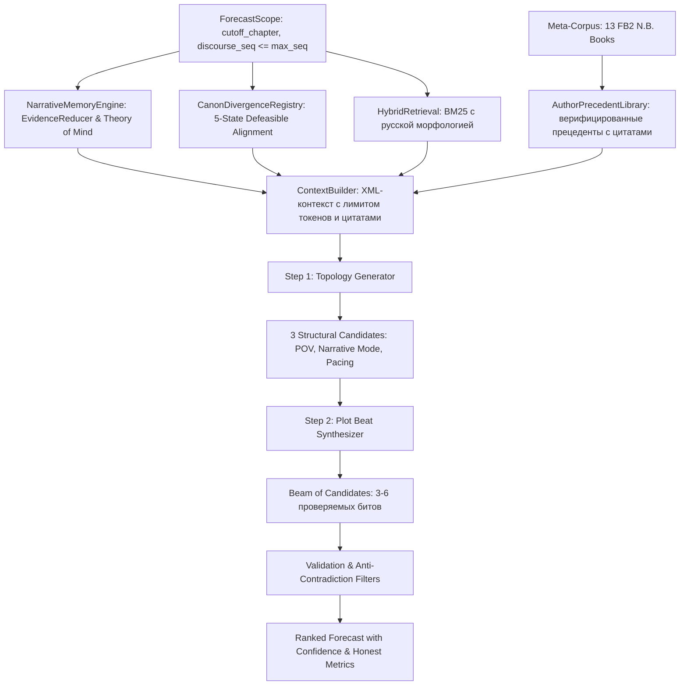
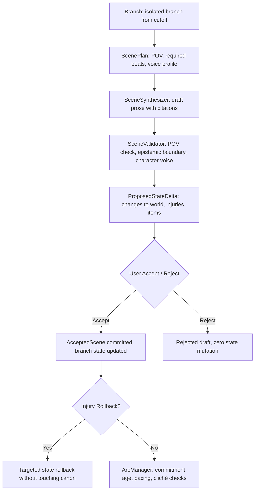

# Архитектура Story Forecaster

Story Forecaster: модульная автономная система сюжетного прогнозирования, анализа нарративных структур и генерации продолжений в изолированных ветках для романа **«Система Абсолютного З.Л.А.»** автора N.B. (~1.12 млн знаков, 24 опубликованные главы) и мета-корпуса из 13 произведений (~20 млн знаков).

---

## 1. Концептуальная модель и ключевые инварианты

Система построена на строгом соблюдении следующих инвариантов:

1. **Zero Future Leakage (Нулевая утечка будущего):**
   - Предиктор и поисковый движок оперируют строго в границах разрешенного среза `ForecastScope`.
   - Любые тексты, индексы или сущности с `discourse_seq > cutoff` физически блокируются на уровне SQL-запросов и фильтров поиска.
2. **Defeasible Canon Alignment (Опровержимое согласование канона):**
   - 4 ортогональные оси: `relation` (MODIFIED, CONFIRMED, PRESUMED_INTACT), `evidence` (EXPLICIT, INFERRED), `dependency` (VALID, NEEDS_REVIEW), `occurrence` (OBSERVED, NOT_OBSERVED).
   - Смещение таймлайна (поступление Хачимана за 1 год до канонического Прорыва) защищает от ложных триггеров зомби-апокалипсиса в мирный период школы Фудзими.
3. **Theory of Mind и EvidenceReducer (Эпистемическая асимметрия):**
   - Факты мира отделены от диалоговых реплик персонажей, предположений рассказчика и субъективных верований.
   - Знания читателя, знания протагониста (Хачиман), подчиненных (Кадзума) и наблюдателей отслеживаются раздельно с точной привязкой к координатам источников.
4. **Author Tropes & Transition Library (Верифицированные прецеденты автора):**
   - Прецеденты автора снабжены точными символьными диапазонами и SHA-256 хешами фрагментов текста, исключая галлюцинации и размытые правила.
5. **Isolated Fanfic Branches & State Deltas (Изолированные ветки фанфика):**
   - Написание продолжений ведется в изолированных таблицах веток `branches` и `branch_scenes`.
   - Черновики не мутируют память канона. Изменения состояния мира (`ProposedStateDelta`) проходят строгую валидацию на выполнимость и принимаются транзакционно с возможностью отката ранений и фактов.
6. **Multi-Chapter Arc Commitments & Editorial Scorecard:**
   - Планирование арок (`ArcPlan`) с контролем обещаний читателю (`ReaderPromise`), выявлением старения линий (>4 сцен) и циклических повторений конфликтов.
   - Редакторский аудит оценивает вариативность темпа сцен, штрафует за штампы/клише и проверяет консистентность речевых профилей персонажей.
7. **Persistent Background Task Queue:**
   - Очередь асинхронных задач на SQLite с пошаговым трекингом прогресса, жестким контролем бюджета расходов и кооперативной отменой.

---

## 2. Модульная структура

```
backend/src/story_forecaster/
├── api/          # FastAPI REST API (эндпоинты прогнозирования, веток, арок, задач)
├── author/       # Библиотека прецедентов автора с точными цитатами и sha256
├── canon/        # 5-статусный реестр канона H.O.T.D. и валидатор зависимостей
├── db/           # SQLAlchemy ORM, модели (Project, Chapter, Scene, Branch, Arc, AsyncTask)
├── domain/       # Pydantic v2 контракты (Scope, Candidate, Snapshot, Branch, Arc, Voice)
├── evaluation/   # 1-to-1 bipartite matching оценщик, штрафы противоречий, абляция
├── forecast/     # ContextBuilder с XML-структурой, двухшаговый генератор гипотез
├── ingestion/    # Нормализаторы текстов, парсер глав/сцен, идемпотентный апдейтер
├── memory/       # EvidenceReducer, Theory of Mind, снапшоты состояния и активные линии
├── planning/     # ArcManager, трекер обязательств, редакторский аудит глав
├── providers/    # Двухуровневый LLM-шлюз (DemoProvider + GeminiProvider)
├── retrieval/    # BM25 с русской морфологией (стемминг) и кешированием по Scope
├── tasks/        # Persistent TaskQueue на SQLite с отменой и лимитами расходов
├── writing/      # BranchService, SceneSynthesizer, SceneValidator, VoiceRegistry
└── cli.py        # Единая консоль управления (Typer + Rich)
```

---

## 3. Конвейер генерации прогноза (Pipeline)



---

## 4. Конвейер ветки фанфика (Writing Pipeline)



---

## 5. Оценка и валидация (Evaluation & Backtest)

1. **Greedy 1-to-1 Bipartite Matching:**
   - Каждое предсказанное событие сопоставляется максимум с одним эталонным (Gold) событием.
   - Исключается завышение метрик обобщенными формулировками.
   - Противоположные события (разрушение против создания) получают строго 0.0 сходства.
2. **Честная абляция конфигураций:**
   - **B0 Baseline**: базовый контекст последних сцен.
   - **B1 Context**: контекст + память на свидетельствах.
   - **B2 Hybrid**: контекст + память + морфологический поиск BM25.
   - **Full System**: подключение оверлеев канона и прецедентов автора.
3. **Автоматический тестовый набор:**
   - 90 автоматизированных тестов с 100% покрытием критических путей и инвариантов.
