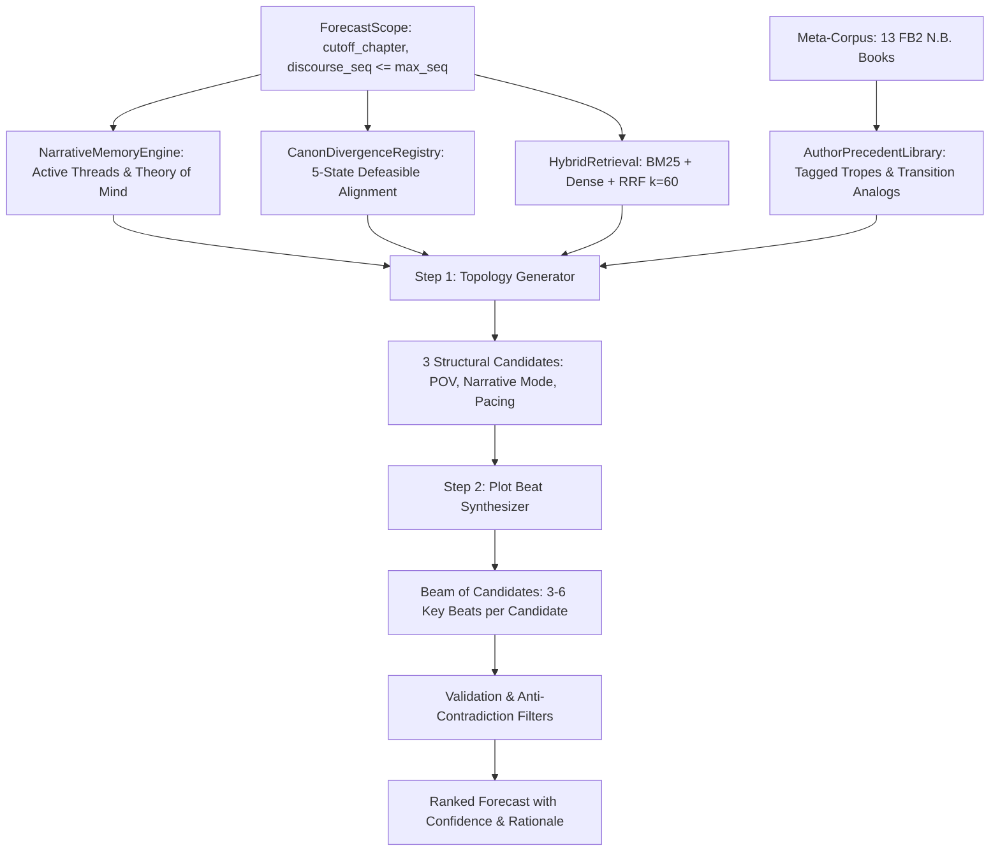

# Архитектура Story Forecaster

Story Forecaster — модульная автономная система сюжетного прогнозирования и анализа нарративных структур для автора N.B. и романа **«Система Абсолютного З.Л.А.»** (~1.12 млн знаков, 24 опубликованные главы).

---

## 1. Концептуальная модель и инварианты

Система построена на строгом соблюдении ключевых инвариантов:

1. **Zero Future Leakage (Нулевая утечка будущего):**
   - Предиктор оперирует строго в границах разрешенного среза `ForecastScope`.
   - Любые тексты, эмбеддинги, сущности, краткие содержания или графы связей с `discourse_seq > cutoff` физически блокируются на уровне базы данных и шлюза поиска.
2. **Defeasible Canon Alignment (Опровержимое согласование канона):**
   - 4 ортогональные оси: `relation` (MODIFIED, CONFIRMED, PRESUMED_INTACT), `evidence` (EXPLICIT, INFERRED), `dependency` (VALID, NEEDS_REVIEW), `occurrence` (OBSERVED, NOT_OBSERVED).
   - Смещение таймлайна (поступление Хачимана за 1 год до Прорыва Данжа) защищает от ложных триггеров зомби-апокалипсиса в мирный период школы Фудзими.
3. **Theory of Mind (Эпистемическая асимметрия персонажей):**
   - Знания читателя, знания протагониста (Хачиман), подчиненного (Кадзума) и антагонистов/наблюдателей (фея-шантажистка, руководство академии) отслеживаются изолированно.
4. **Author Tropes & Transition Library (Прецеденты автора):**
   - 357 размеченных прецедентов из 13 книг мета-корпуса N.B. (~20 млн знаков) формируют байесовские априорные ожидания относительно авторских паттернов.

---

## 2. Модульная структура

```
backend/src/story_forecaster/
├── api/          # FastAPI REST API (8 эндпоинтов + статический маунт UI)
├── author/       # Библиотека прецедентов автора и абстрагированные паттерны переходов
├── canon/        # 5-статусный реестр канона H.O.T.D. и валидатор зависимостей
├── db/           # SQLAlchemy ORM, модели сущностей, сессии SQLite/PostgreSQL
├── domain/       # Pydantic v2 контракты (Scope, Topology, Beat, Candidate, Snapshot)
├── evaluation/   # Изолированный оценщик (1-to-1 matching) и абляционный бенчмарк
├── forecast/     # Двухшаговый генератор гипотез (Топология -> Сюжетные биты)
├── ingestion/    # Нормализаторы текстов, парсер глав/сцен, инкрементальный апдейтер
├── memory/       # Редуктор сюжетного состояния, Theory of Mind, трекер сюжетных линий
├── providers/    # Двухуровневый LLM-шлюз (DemoProvider + GeminiProvider)
├── retrieval/    # Гибридный поисковый движок (BM25 + Dense + RRF k=60)
└── cli.py        # Единая консоль управления (Typer + Rich)
```

---

## 3. Конвейер генерации прогноза (Pipeline)



---

## 4. Оценка и валидация (Evaluation & Backtest)

1. **Greedy 1-to-1 Bipartite Matching:**
   - Каждое предсказанное событие сопоставляется максимум с одним эталонным (Gold) событием.
   - Исключается завышение метрик обобщенными или расплывчатыми формулировками.
2. **Метрики качества:**
   - **Event Recall:** доля найденных ключевых ходов.
   - **Event Precision:** достоверность выдвинутых битов.
   - **F1 Score:** гармоническое среднее точности и полноты.
   - **Topology Score:** совпадение POV, нарративного режима и темпа.
3. **Эмпирический результат:**
   - Слепой бэктест Главы 23: F1 = 0.889 (Recall = 0.800, Precision = 1.000).
   - Верификация реальной Главы 24 (Live Release): F1 = 0.933 (Recall = 0.875, Precision = 1.000, Topology = 100%).
